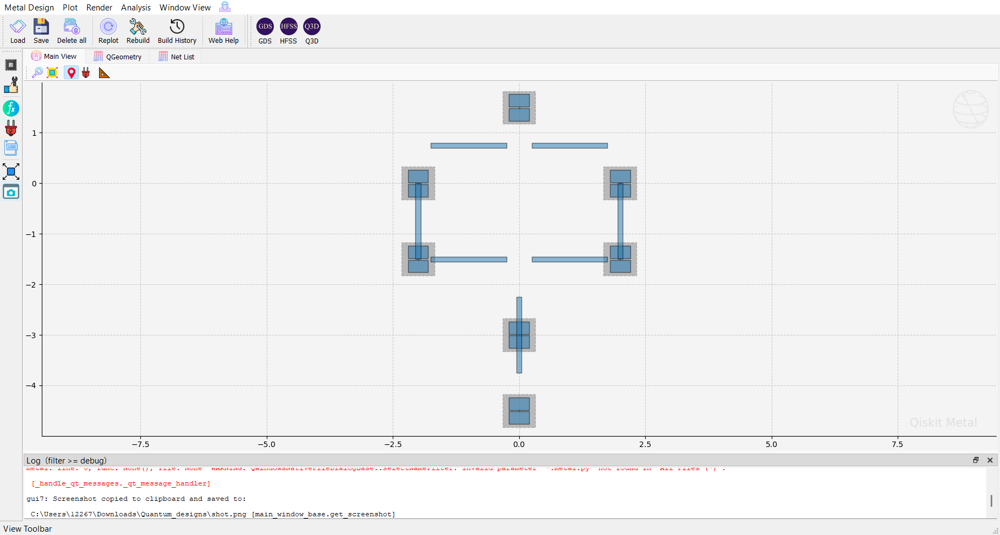

# 7-Qubit Heavy-Hex Layout – Explanation

## Overview

This layout represents a 7-qubit heavy-hex unit cell, which is the fundamental building block used in scalable superconducting quantum processors.
## Layout

---

## Geometry

The layout follows a heavy-hex connectivity pattern:

        Q0
      /    \
    Q1      Q2
    |        |
    Q3 — Q4 — Q5
          |
          Q6

Each node represents a transmon qubit, and each edge represents a coupling bus.

---

## Implementation Details

- Qubits are implemented using `TransmonPocket`
- Interconnects are currently modeled using rectangular geometries
- This stage focuses on layout topology rather than full EM correctness

---

## Why This Approach

At this stage, the goal is to:

- Establish correct connectivity
- Ensure stable geometry generation
- Avoid routing instabilities from automated solvers

---

## Current Limitations

- No CPW impedance modeling
- No electromagnetic simulation
- No Hamiltonian extraction yet

---

## Next Steps

- Replace rectangular buses with CPW routing
- Export layout to GDS
- Run HFSS simulations
- Perform EPR analysis
